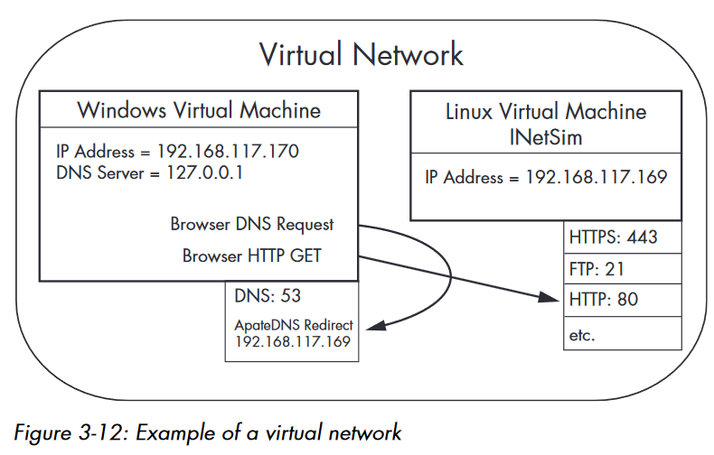
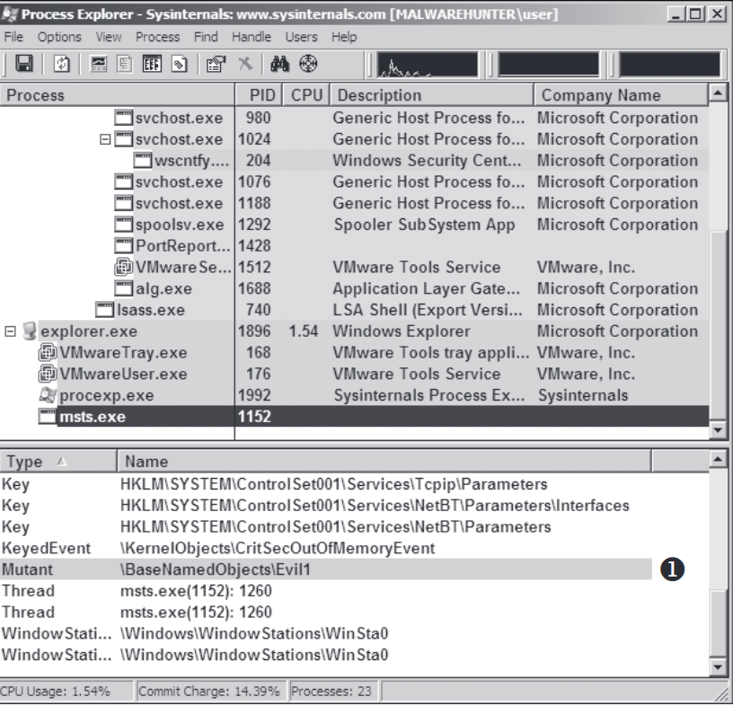

## Basic Dynamic Analysis

- [Basic Dynamic Analysis](#basic-dynamic-analysis)
  - [Sandbox](#sandbox)
  - [Running Malware](#running-malware)
  - [Monitoring with Process Monitor (Procmon)](#monitoring-with-process-monitor-procmon)
  - [Viewing Process with Process Explorer](#viewing-process-with-process-explorer)
  - [Comparing Registry Snapshots with Regshot](#comparing-registry-snapshots-with-regshot)
  - [Faking a Network](#faking-a-network)
  - [Packet Sniffing with Wireshark](#packet-sniffing-with-wireshark)
  - [Using INetSim](#using-inetsim)
  - [Summary and Examples](#summary-and-examples)

### Sandbox

- Drawbacks to using a sandbox:
  1. Execution and payload delivery must be quick
     - sandbox won't wait forever
     - malware sleeps
  2. Most sandboxes use VMs
     - can be detected by malware
  3. Sandbox environments may be missing required DLLs or environment variables
  4. Incompatible OS
  5. External inputs required  

- Malware Sandboxes
  - Norman
  - CW Sandbox (GFI Sandbox)
  - Anubis
  - Joe Sandbox
  - ThreatExpert
  - BitBlaze
  - Comodo Instant Malware Analysis

### Running Malware

- *.exe* malware can be run by double-clicking the executable or from command line
- *.dll* malware can be run using the program *rundll32.exe* which is included with Windows
  - `C:\>rundll32.exe [DLLname], [Export] [Arguments]`
  - export value must be a function name or ordinal selected from the exported function table in the DLL (can use tools such as *PE-bear*/*PEID* to view the export table)
  - functions can also be exported by ordinal (syntax: `#[Ordianl number]`)
- Alternative: turn *dll* into executable by modifying PE header and changing the extension
  - wipe the *IMAGE_FILE_DLL (0x2000)* flag from the *Characteristics* field in the *IMAGE_FILE_HEADER*
  - the malware may crash, but if it execute its malicious payload, we can collection information from it
- DLL malware may also need to be installed as a service
  - for example, *InstallService* is found in the export table of *ipr32x.dll*, then we can run
  - `C:\>rundll32 ipr32x.dll,InstallService ServiceName`
  - `C:\>net start ServiceName`
  - *ServiceName* argument must be provided to the malware so it can be installed and run. The net start command is used to start a service on a Windows system.

_When you see a ServiceMain function without a convenient exported function such as Install or InstallService, you may need to install the service manually. You can do this by using the Windows sc command or by modifying the registry for an unused service, and then using net start on that service. The service entries are located in the registry at HKLM\SYSTEM\CurrentControlSet\Services._

### Monitoring with Process Monitor (Procmon)

-  Can use to monitor certain registry, file system, network, process, and thread activity
-  Procmon may not capture some data such as,
   -  device driver activity of a user-mode component talking to a rootkit via device I/O controls
   -  certain GUI calls, such as SetWindowsHookEx.

- Only run Procmon for limited periods of time, and before using Procmon for analysis, clear all currently captured events to remove irrelevant data
  - Procmon uses RAM to log events and will monitors all system calls (can be >50,000/min) which will cause VM to crash when all available memory is used

### Viewing Process with Process Explorer

- By default
  - pink $\implies$ services 
  - blue $\implies$ processes 
  - green $\implies$ new processes
  - red $\implies$ terminated processes
  - green and red are temporary
- The *verify button* on the Image tab can be used to verify a file is actually executable from Microsoft
  - useful for verifying that the Windows file on disk has not been corrupted
  - verify button verifies the image on disk rather than in memory, and it is useless if an attacker uses *process replacement*
    - *Process replacement*:  running a process on the system and overwriting its memory space with a malicious executable, malware has the same privileges as the process it replaced
    - compare strings using the String tab in Process Properties window to identify *Process replacement*
- The *Find DLL* option is useful to know if any running processes use a malicious DLL
  - not every DLL loaded during runtime, use it with *Dependency Walker*
- Process Explorer can also use to analyze malicious documents, such as PDFs and Word documents

### Comparing Registry Snapshots with Regshot

- A tool to take and compare two registry snapshots
- Steps:
  1. Before running the malware, take 1st snapshot
  2. Run the malware and wait for it to finish making any system changes
  3. Take 2nd snapshot
  4. Compare

### Faking a Network

- Create a fake network and quickly obtain network indicators, without actually connecting to the Internet. Indicators can include:
  - DNS names
  - IP addresses
  - packet signatures

### Packet Sniffing with Wireshark

- Packet capture tool that intercepts and logs network traffic

### Using INetSim

- Linux-based software suite for simulating common Internet services
- Free tool for providing fake services, allowing you to analyze the network behavior of unknown malware samples by emulating services such as HTTP, HTTPS, FTP, SMTP, and others

### Summary and Examples

Example setup: 

1. Running procmon and setting a filter on the malware executable name and clearing out all events just before running.
2. Starting Process Explorer.
3. Gathering a first snapshot of the registry using Regshot.
4. Setting up your virtual network to your liking using INetSim and ApateDNS.
5. Setting up network traffic logging using Wireshark.

Figure 3-12 shows:
- Windows VM and Linux VM running INetSim
- Linux VM is listening on many ports through the use of INetSim
- Windows VM is listening on port 53 for DNS requests through the use of ApateDNS
- The DNS server for the Windows VM has been configured to localhost (127.0.0.1)
- ApateDNS is configured to redirect to the Linux VM (192.168.117.169)
- A browser perform a GET request over port 80 to the INetSim server (DNS request will be resolved by ApateDNS to redirect to the Linux VM)

After the setup and then run a malware (msts.exe) on the Windows VM, we begin analysis as follows:

1. Examine ApateDNS to see if DNS requests were performed.
   - 
   - We notice that the malware performed a DNS request for www.malwareanalysisbook.com

2. Review the procmon results for file system modifications.
   - 
   - We see CreateFile and WriteFile operations for C:\WINDOWS\system32\winhlp2.exe
   - Upon comparing winhlp2.exe to msts.exe, we noticed they are identical, hence we conclude that the malware copies itself to that location

3. Compare the two snapshots taken with Regshot to identify changes.
   - 
   - We see that the malware installed the autorun registry value winhlp at HKLM\SOFTWARE\Microsoft\Windows\CurrentVersion\Run location.
   - The data written to that value is where the malware copied itself
   - And the newly copied binary will execute upon system reboot

4. Use Process Explorer to examine the process to determine whether it creates mutexes or listens for incoming connections.
   - 
   - Process Explorer shows msts.exe creates a mutex (a.k.a mutant)
   - msts.exe likely created the mutex to ensure that only one version of the malware is running at a time
   - Mutexes can provide an excellent fingerprint for malware if they are unique enough

5. Review the INetSim logs for requests and attempted connections on standard services.
   - 
   - The malware communicates over port 443, but not with SSL, as shown next in the reported errors

6. Review the Wireshark capture for network traffic generated by the malware.
   - 
   - Wireshark captures TCP handshake and the initial data packets sent by the malware
   - The contents of the TCP stream sent over port 443, shows random ACSII data, which is often indicative of a custom protocol
   - We can run the malware several more times to look for any consistency in the initial packets of the connection. The resulting information could be used to draft a network-based signature.