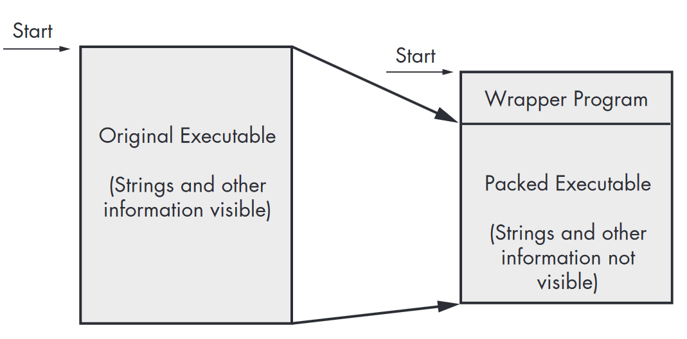
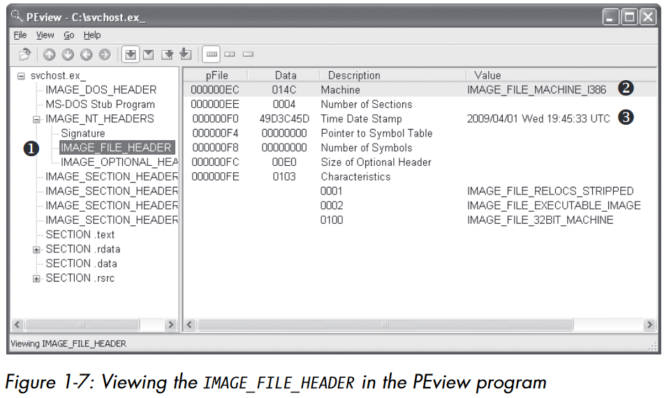
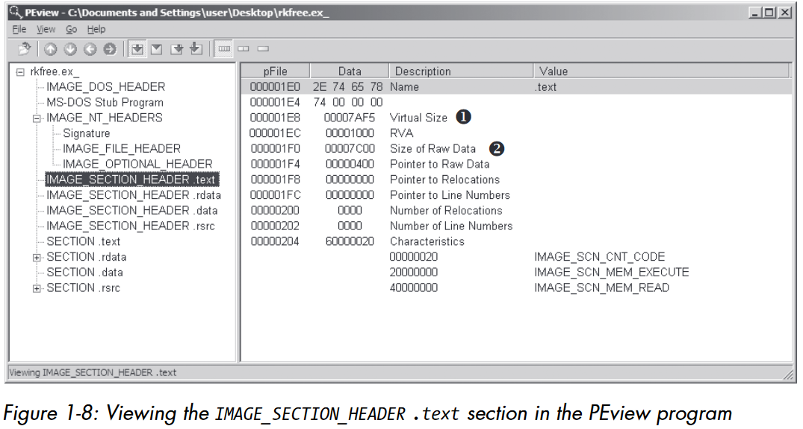
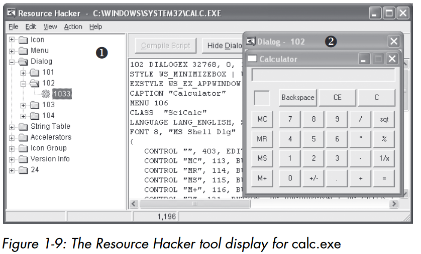

## Basic Static Analysis

### Antivirus Scanning

- Useful Website: <https://virustotal.com>

### Hashing

- Used to uniquely identify malware
- Commonly used hash algorithms: 
  - Message-Digest Algorithm 5 (**MD5**)
  - Secure Hash Algorithm 1 (**SHA-1**)
- The hash can:
  - use as a label
  - share with other analysts
  - search online to see if the file has already been identified

Tools can be used: [md5deep](https://md5deep.sourceforge.net/) to generate hash

### Strings

- A program contain strings if it:  
  - prints messages
  - connects to a URL
  - copies file to a specific location
- Searching through the strings can be a simple way to get hints about the functionality of a program

#### ASCII and Unicode

_Microsoft uses the term **wide character string** to describe its implementation of Unicode strings, which varies from the Unicode standards. Throughout this book, when we refer to Unicode, we are referring to the Microsoft implementation._

- String end with a **NULL terminator** to indicate end of string
- **ASCII** strings use 1 byte per character
  - Example: _BAD_ will be stored as

|B|A|D|\0|
|---|---|---|---|
|0x42|0x41|0x44|0x00|

- **Unicode** strings use 2 bytes per character
  - Example: _BAD_ WILL BE stored as

|B|A|D|\0|
|---|---|---|---|
|0x42 0x00|0x41 0x00|0x44 0x00|0x00 0x00|

Tools can be used: Strings (for Windows, download the [Sysinternals Suite](https://learn.microsoft.com/en-gb/sysinternals/downloads/sysinternals-suite))

### Packed and Obfuscated Malware

- **Obfuscated** programs are ones whoes execution the malware author attempted to hide
- **Packed** programs are a subset of obfuscated programs in which the malicious program is compressed and cannot be analyzed
- Legitimate program almost always include may string, so a program that contain very few strings may suggest it is malicious

_Packed and obfuscated code will often include at least te functions **LoadLibrary** and **GetProcAddress**, which are used to load and gain access to additional functions._

#### Packing Files

- When the packed program is run, a small wrapper program also runs to decompress the packed files and then run the unpacked file.
- When analyzed statically, only the small wrapper program can be dissected.
- 
- Tools such as [PEid](https://www.aldeid.com/wiki/PEiD) can be used to identify which packer was used to pack the file
- [UPX](https://github.com/upx/upx) is a popular packer (which also can be used for unpacking malware packed with it)

_Many PEiD plug-ins will run the malware executable without warning!_

### Portable Executable File Format

- **PE file format** is a data structure that contains the information necessary for the Windows OS loader to manage the wrapped executable code
- Includes 
  - information about the code
  - type of application
  - required library functions
  - space requirements

### Linked Libraries and Functions

- **Imports** are functions used by one program but stored in a different program
- Code libraries can be connected to the main executable by **linking**
- **Static linking**
  - all code from the library is copied into the executable
  - makes the executable bigger
  - difficult to differentiate between statically linked code and executable's own code
- **Runtime linking**
  - connect to libraries only when that function is needed
  - not at program start
  - unpopular in friendly programs, but commonly used in malware, especially when it's packed or obfuscated
- **Dynamic linking**
  - OS searches for the necessary libraries when the program is loaded
  - most commonly used
  - when the program calls the linked library function, that function executes within the library
- PE file header stores information about every library and function that will be loaded
- Some functions can be import but not listed in a program's file header, such as,
  - *LoadLibrary*
  - *GetProcAddress*
  - *LdrGetProcAddress*
  - *LdrLoadDLL*
- *LoadLibrary* and *GetProcAddress* allow program to access any function in any library on the system, so when these functions are used, we can't tell statically which functions are being linked to by the suspect program
- Executables can import functions by ordinal instead of name, to find out which function is being imported by comparing the ordinal value with the list of functions in the library
- ***Windows function naming conventions***
  - *Ex suffix*
    - when Microsoft updates a function and the new function is incompatible with the old one, Microsoft continues to support the old function. The new function is given the same name as the old function, with an added Ex suffix
    - Example: *CreateWindowEx*
  - *A/W suffix*
    - functions take in stirng as parameter
    - *A* stands for *ASCII strings*
    - *W* stands for *wide character strings*
    - *this letter does not appear in the documentation for the function*
    - Example: *CreateDirectoryW*
- DLLs is designed to export functions, but EXEs can also export functions although rarely

List of common DLLs

|DLL|Description|
|---|---|
|Kernel32.dll|This is a very common DLL that contains core functionality, such as access and manipulation of memory, files, and hardware.|
|Advapi32.dll|This DLL provides access to advanced core Windows components such as the Service Manager and Registry.|
|User32.dll|This DLL contains all the user-interface components, such as buttons, scroll bars, and components for controlling and responding to user actions.|
|Gdi32.dll|This DLL contains functions for displaying and manipulating graphics.|
|Ntdll.dll|This DLL is the interface to the Windows kernel. Executables generally do not import this file directly, although it is always imported indirectly by Kernel32.dll. If an executable imports this file, it means that the author intended to use functionality not normally available to Windows programs. Some tasks, such as hiding functionality or manipulating processes, will use this interface|
|WSock32.dll and Ws2_32.dll|These are networking DLLs. A program that accesses either of these most likely connects to a network or performs network-related tasks.|
|Wininet.dll|This DLL contains higher-level networking functions that implement protocols such as FTP, HTTP, and NTP.|

Tools can be used: [Dependency Walker (Dependencies)](https://github.com/lucasg/Dependencies)

### PE File Headers and Sections

- PE file format contains a header followed by a series of sections
  - header contains metadata about the file
  - follow by sections of the file

Sections of a PE File for a Windows Executable

|Section|Description|
|---|---|
|.text|Contains the executable code|
|.rdata|Stores *read-only global data* accessed throughout the program|
|.data|Stores *global data* accessed throughout the porgram|
|.idata|Sometimes present and stores the import function information; if this sections is not present, the import function information is stored in the .rdata section|
|.edata|Sometimes present and stores the export function information; if this sections is not present, the export function information is stored in the .rdata section|
|.pdata|Present only in 64-bit executables and stores exception-handling information|
|.rsrc|Store resources needed by the executable (icons, images, menus and strings (strings can also be stored in main program))|
|.reloc|Contains information for relocation of library files|

_Windows doesn’t care about the actual name since it uses other information in the PE header to determine how a section is used. Furthermore, the section names are sometimes obfuscated to make analysis more difficult_

#### Examining PE Files with PEview

- *IMAGE_DOS_HEADER* and *MS-DOS Stub Program* are historical and offer no imformation of particular interesting
- *IMAGE_NT_HEADERS* shows the NT headers
  - *Signature* is always the same and can be ignored
  - *IMAGE_FILE_HEADER* contains basic information about the file
    - The *Time Date Stamp* tells us when this executable was compiled, but all Delphi programs use a compile time of June 19, 1992. Also, a competent malware writer can easily fake the compile time
  - *IMAGE_OPTIONAL_HEADER* also includes several important information
    - *Subsystem* indicates whether this is a console or GUI program  
      - Console program have the value *IMAGE_SUBSYSTEM_WINDOWS_CUI*
      - GUI program have the value *IMAGE_SUBSYSTEM_WINDOWS_GUI*
      - Less common subsystem such as *Native* and *Xbox* are also used

- *IMAGE_SECTION_HEADER*s are used to describe each section of an executable
  - *Virtual Size* shows how much sace is allocated for a section during loading process
  - *Size of Raw Data* shows how big the section is on disk
  - These two values should usually be equal, small differences are normal and are due to differences between alignment in memory and on disk
  - If the *Virtual Size* is much larger than the *Size of Raw Data* means the section takes up more space in memory than it does on disk, indicative of packed code, particularly if the *.text* section is larger in memory than on disk
  - It is normal for *.data* section to have larger *Virtual Size* than *Size of Raw Data*, but it doesn't mean the program is not malicious

Tools can be used: [PEview](http://wjradburn.com/software/)
Alternative Tools: [PEBrowse Professional](), [PE Explorer](), [PE Tree](https://github.com/blackberry/pe_tree)

#### Viewing the Resource Section (.rsrc) with Resource Hacker

- The only section we can examine without additional knowledge from later chapters is the *resoursce* section, and we will be using *Resource Hacker* to browse through
- 
- Each root folder shown in the left pane at *1* stores different type of resource
- Informative sections for malware analysis:
  - Icon section - lists images shown when th eexecutable is in a file listing
  - Menu section - stores all mennus that appear in various windows, such as File, Edit and View menus. This section contains the names of all the menus and the text shown for each
  - Dialog section - contains the program's dialog menus
  - String Table section - stores strings
  - Version Info section - contains a version number and often the company name and a copyright statement

_Malware often store an embedded program or driver here and before the program runs, they extract the embedded executable or driver. We can use Resource Hacker to extract these files for individual analysis._

Tools can be used: [Resource Hacker](https://www.angusj.com/resourcehacker/)
